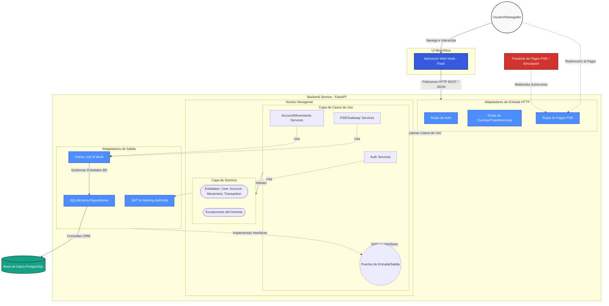

# Arquitectura del Sistema: Banco Hexagonal

El proyecto implementa un sistema bancario utilizando un modelo cliente-servidor, donde el frontend es renderizado en el lado de servidor (`flask_app`) y el backend principal se encarga de la lógica de negocio mediante una **Arquitectura Hexagonal** en `fastapi_app`.

## Diagrama de Arquitectura

## Resumen de la Arquitectura

1. **Usuario / Navegador (`flask_app`)**:
   - Actúa como la capa de interfaz visual (Views y Templates).
   - No tiene conexión directa con la base de datos.
   - Envía peticiones HTTP al backend en FastAPI enviando el estado de sesión (JWT Headers).
   
2. **Backend Hexagonal (`fastapi_app`)**:
   - Está dividido en capas siguiendo el principio de inversión de dependencias:
     - **Capa de Dominio (`domain/`)**: Representa la "verdad empresarial", contiene entidades de datos (User, Account) que no dependen de la web u ORM.
     - **Capa de Aplicación (`application/`)**: Contiene los "Casos de Uso" o flujos de usuario (autenticarse, listar cuentas, hacer pagos PSE) y los Puertos (Interfaces).
     - **Adaptadores de Entrada (`adapters/inbound/`)**: Entregables de red, como el Router en FastAPI que recibe un JSON y lo pasa al caso de uso correspondiente.
     - **Adaptadores de Salida (`adapters/outbound/`)**: Servicios de infraestructura. Contiene la conexión real a Postgres con el patrón **Repository** y **UnitOfWork**, manteniendo acoplada a SQLAlchemy de forma aislada a las capas internas.

3. **Base de Datos (`app/docker-compose`)**:
   - Base de datos relacional (PostgreSQL) gestionada de forma externa al código fuente y enrutada por Docker.
