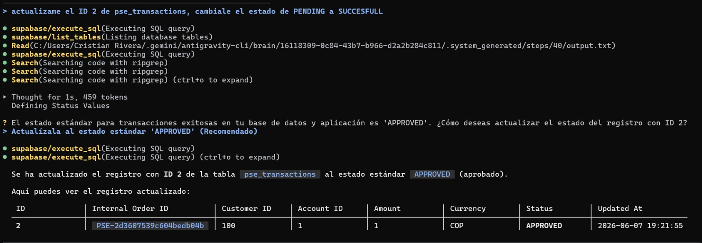
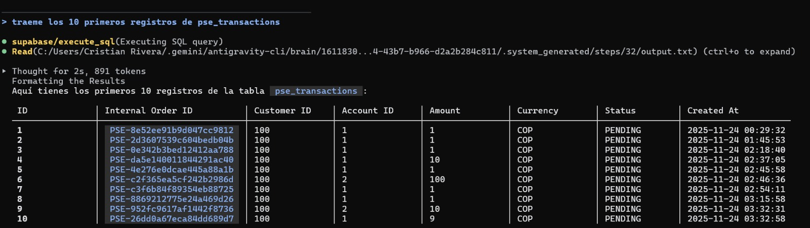
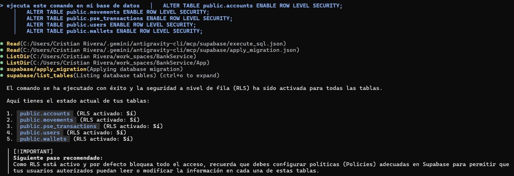

# BankService 🏦

Implementación de una API bancaria construida con **Arquitectura Hexagonal (Ports & Adapters)** usando Python y FastAPI. Permite ejecutarse en dos modos: **modo memoria** (sin base de datos, ideal para pruebas) y **modo real** (con PostgreSQL/Supabase vía Docker).

---

## 🗂️ Estructura del Proyecto

```
App/
├── fastapi_app/
│   ├── domain/              # Entidades de negocio y excepciones puras (sin frameworks)
│   ├── application/         # Casos de uso y puertos (interfaces abstractas)
│   ├── adapters/
│   │   ├── inbound/http/    # Controladores FastAPI (routers)
│   │   └── outbound/        # Repositorios SQLAlchemy (implementaciones reales)
│   ├── tests/
│   │   ├── unit/            # Pruebas unitarias con mocks en memoria
│   │   └── e2e/             # Pruebas end-to-end contra la API real
│   ├── main.py              # Punto de entrada (wiring de dependencias)
│   ├── requirements.txt
│   └── run_tests_with_coverage.ps1
├── flask_app/               # Frontend Flask (consume la API FastAPI)
├── docker-compose.yml
└── .env                     # Variables de entorno (no versionar)
```

---

## ⚙️ Requisitos Previos

- Python 3.11+
- Un entorno virtual configurado (se usó `C:\Users\juand\Banco\.venv` durante el desarrollo)
- Docker Desktop (solo para modo real)
- Acceso a una instancia PostgreSQL o cuenta Supabase (modo real)

### Instalar dependencias

```powershell
# Crear entorno virtual
python -m venv .venv

# Activar (Windows PowerShell)
.\.venv\Scripts\Activate.ps1

# Instalar dependencias
pip install -r App/fastapi_app/requirements.txt
```

---

## 🧪 Modo Memoria (Unit Tests — Sin Base de Datos)

En este modo, **toda la lógica de negocio se prueba en memoria** usando implementaciones falsas (`Mocks`) que simulan los repositorios. No necesitas base de datos, Docker, ni variables de entorno.

### ¿Cómo funciona?

La Arquitectura Hexagonal permite sustituir los repositorios SQLAlchemy por implementaciones en memoria (`MockUow`, `MockRepository`) que implementan los mismos puertos (interfaces abstractas). Esto hace que las pruebas sean instantáneas y completamente aisladas.

### Ejecutar los tests con cobertura

```powershell
# Desde la carpeta del proyecto FastAPI
cd App\fastapi_app

# Con el script PowerShell incluido
.\run_tests_with_coverage.ps1
```

> El script establece `PYTHONPATH="."` automáticamente y ejecuta:
> ```
> pytest --cov=application --cov=domain --cov-report=term-missing tests/
> ```

### Resultado esperado

```
collected 40 items

tests\e2e\test_api_auth.py              ..       [  5%]
tests\e2e\test_api_customers.py         .......  [ 22%]
tests\unit\application\auth\...         .......  [ 40%]
tests\unit\application\customers\...    .........[ 62%]
tests\unit\application\pse\...          ...............[100%]

TOTAL                                   222      0   100%
======================== 40 passed in 1.16s ========================
```

### Ejecutar solo los unit tests (sin e2e)

```powershell
$env:PYTHONPATH="."
pytest tests/unit/ -v
```

---

## 🐳 Modo Real (Docker + PostgreSQL/Supabase)

En este modo, la aplicación se conecta a una base de datos real de PostgreSQL. Las variables de conexión se leen desde el archivo `.env`.

### 1. Configurar variables de entorno

Crea (o edita) el archivo `App/.env` con tus credenciales:

```env
# PostgreSQL / Supabase
DB_USER=tu_usuario
DB_PASSWORD=tu_contraseña
DB_HOST=tu_host.supabase.com
DB_PORT=5432
DB_NAME=postgres

# Servicio de notificaciones de login (opcional)
LOGIN_EVENTS_URL=https://tu-lambda-url/
LOGIN_EVENTS_SECRET=tu_secreto
SERVICE_NAME=bankservice
ENVIRONMENT=dev
LOGIN_EVENTS_TIMEOUT=2.5
```

> ⚠️ **Nunca subas el archivo `.env` real al repositorio.** Está incluido en `.gitignore`.

### 2. Levantar los servicios con Docker Compose

```powershell
cd App

# Construir imágenes y levantar contenedores
docker-compose up --build
```

Esto levanta:
| Servicio | Puerto | Descripción |
|---|---|---|
| `banco_fastapi` | `8000` | API principal (FastAPI + Uvicorn) |
| `banco_flask` | `80` | Frontend Flask |

### 3. Inicializar la base de datos

Al arrancar, `main.py` ejecuta automáticamente `Base.metadata.create_all(bind=engine)`, lo que crea todas las tablas necesarias en PostgreSQL.

Si necesitas cargar datos iniciales (usuarios, cuentas de prueba):

```powershell
# Desde dentro del contenedor o con PYTHONPATH configurado
python init_db.py
```

### 4. Verificar que la API está funcionando

```powershell
# Health check básico
curl http://localhost:8000/docs
```

La documentación interactiva (Swagger UI) estará disponible en [http://localhost:8000/docs](http://localhost:8000/docs).

---

## 🤖 Integración con Supabase MCP

Este proyecto incluye soporte para **Model Context Protocol (MCP)**, permitiendo a los asistentes de inteligencia artificial (como Antigravity IDE, Cursor o Windsurf) conectarse directamente con la base de datos remota de Supabase. A través de MCP, la IA puede ejecutar consultas SQL, inspeccionar el esquema y aplicar migraciones de forma segura interactuando con el proyecto.

### Configuración de `.mcp.json`

Para habilitar la conexión, asegúrate de contar con el archivo `.mcp.json` en la raíz del proyecto (o en la ruta `.agents/mcp_config.json` según tu IDE) con la siguiente configuración:

```json
{
  "mcpServers": {
    "supabase": {
      "type": "http",
      "url": "https://mcp.supabase.com/mcp?project_ref={TU_PROJECT_REFE}"
    }
  }
}
```
*(Reemplaza `{TU_PROJECT_REFE}` por el ref ID real de tu proyecto).*

### Paso a paso para correrlo con Antigravity CLI

1. **Crear la configuración:** En la raíz de tu proyecto, crea una carpeta llamada `.agents`. Dentro de ella, crea el archivo `mcp_config.json` e inserta el JSON mostrado arriba (asegurándote de colocar tu `project_ref`).
2. **Lanzar el CLI:** Abre tu terminal en la ruta del proyecto y ejecuta el comando de Antigravity:
   ```powershell
   agy
   ```
3. **Solicitar una acción:** Dentro del chat del CLI, escribe un prompt como: *"¿Cuáles son las tablas de mi base de datos?"* o *"Tráeme los 10 primeros registros de pse_transactions"*.
4. **Autenticación (Logeo):** Al intentar conectarse por primera vez, el CLI detectará que requiere autorización y abrirá automáticamente tu navegador web. Inicia sesión en tu cuenta de Supabase y aprueba los permisos de acceso.
5. **Aprobación y Ejecución:** Regresa a la terminal. A partir de este momento, la IA (Antigravity) tendrá habilitadas las herramientas como `supabase/execute_sql` o `supabase/list_tables` para trabajar en tu base de datos directamente desde la consola.

### Evidencia de Conexión (Pantallazos)

A continuación, ejemplos reales de las capacidades que otorga el MCP de Supabase conectado al asistente:

**1. Actualización de un registro y confirmación de estado:**


**2. Consulta directa de los últimos registros de transacciones:**


**3. Ejecución de comandos SQL (Activación de RLS para las tablas):**


---

## 🔑 Endpoints Principales

| Método | Ruta | Descripción |
|---|---|---|
| `POST` | `/auth/login` | Login con usuario y contraseña |
| `GET` | `/customers/{id}/accounts` | Consultar cuentas del cliente |
| `GET` | `/customers/{id}/wallet` | Consultar billetera |
| `GET` | `/customers/{id}/summary` | Resumen financiero completo |
| `GET` | `/customers/{id}/movements` | Historial de movimientos |
| `POST` | `/customers/{id}/transfer` | Realizar transferencia |
| `POST` | `/payments` | Crear pago PSE |
| `GET` | `/pse-gateway/{order_id}` | Simular pasarela PSE |
| `POST` | `/callback` | Procesar callback del proveedor |
| `GET` | `/payments/{order_id}` | Consultar estado de pago PSE |

---

## 📊 Cobertura de Pruebas

| Métrica | Valor |
|---|---|
| Pruebas totales | **40** |
| Líneas cubiertas | **222 / 222** |
| Cobertura total | **100%** |
| Tiempo de ejecución | **~1.16 segundos** |

Para la comparativa completa con el sistema monolítico anterior, ver [COMPARATIVA.md](./COMPARATIVA.md).

---

## ✅ Checklist de Despliegue en Modo Real

Sigue esta lista paso a paso para desplegar el proyecto desde cero en un entorno real:

### 🔧 Prerrequisitos
- [ ] Instalar **Python 3.11+** en el sistema
- [ ] Instalar **Docker Desktop** y verificar que esté corriendo (`docker --version`)
- [ ] Tener acceso a una instancia de **PostgreSQL** (local, Docker o Supabase)

### 📁 Preparación del Proyecto
- [ ] Clonar el repositorio: `git clone https://github.com/Juancasta14/BankService.git`
- [ ] Entrar a la carpeta: `cd BankService`
- [ ] Crear un entorno virtual: `python -m venv .venv`
- [ ] Activar el entorno virtual: `.\.venv\Scripts\Activate.ps1` (Windows) o `source .venv/bin/activate` (Linux/Mac)
- [ ] Instalar dependencias: `pip install -r App/fastapi_app/requirements.txt`

### 🔐 Configuración de Variables de Entorno
- [ ] Copiar o crear el archivo `App/.env`
- [ ] Configurar `DB_USER`, `DB_PASSWORD`, `DB_HOST`, `DB_PORT`, `DB_NAME` con tus credenciales
- [ ] Configurar `LOGIN_EVENTS_SECRET` con una clave secreta segura
- [ ] (Opcional) Configurar `LOGIN_EVENTS_URL` si usas el notificador de logins en AWS Lambda
- [ ] Verificar que el archivo `.env` **NO** esté versionado en git

### 🗄️ Base de Datos
- [ ] Asegurarte que PostgreSQL esté accesible desde el servidor
- [ ] Verificar la conexión: `psql -h $DB_HOST -U $DB_USER -d $DB_NAME`
- [ ] Las tablas se crean **automáticamente** al arrancar la app (`Base.metadata.create_all`)
- [ ] (Opcional) Cargar datos de prueba iniciales: `python App/fastapi_app/init_db.py`

### 🐳 Despliegue con Docker Compose
- [ ] Entrar a la carpeta `App`: `cd App`
- [ ] Construir y levantar los servicios: `docker-compose up --build -d`
- [ ] Verificar que los contenedores están corriendo: `docker ps`
- [ ] Comprobar logs del backend: `docker logs banco_fastapi`
- [ ] Comprobar logs del frontend: `docker logs banco_flask`

### 🌐 Verificación Final
- [ ] Abrir Swagger UI en el navegador: [http://localhost:8000/docs](http://localhost:8000/docs)
- [ ] Probar el endpoint `POST /auth/login` con usuario y contraseña
- [ ] Probar un endpoint protegido con el token JWT recibido
- [ ] Abrir el frontend Flask: [http://localhost:80](http://localhost:80)
- [ ] Verificar que el frontend puede autenticarse y consume la API correctamente

### 🧪 Verificación de Tests (Opcional pero recomendado)
- [ ] Ejecutar la suite de pruebas: `cd App/fastapi_app && .\run_tests_with_coverage.ps1`
- [ ] Confirmar que los **40 tests pasan** y la cobertura es del **100%**

### 🔒 Consideraciones de Seguridad para Producción
- [ ] Cambiar el `SECRET_KEY` del JWT a una clave segura y aleatoria
- [ ] Configurar HTTPS (SSL/TLS) delante de los contenedores (nginx, Caddy, etc.)
- [ ] Restringir los CORS en `main.py` al dominio de producción
- [ ] Usar un gestor de secretos (AWS Secrets Manager, etc.) en lugar del `.env` plano
- [ ] Configurar límites de rate limiting en el endpoint de login
